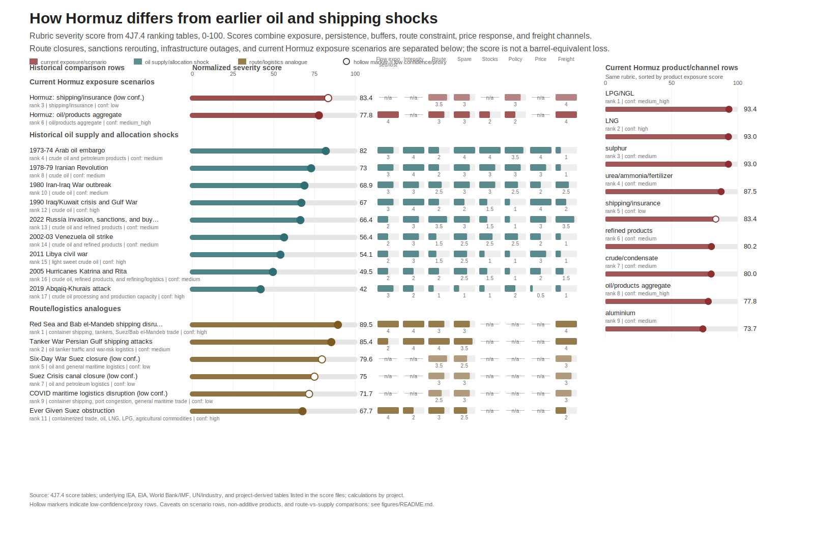

# Hormuz Historical Shock Comparison

Last updated: 2026-07-06.

## Bottom Line

The current Hormuz shock is not best understood as "the biggest oil shock ever." It is more interesting than that. On crude oil alone, partial Saudi/UAE bypass capacity, strategic stocks, inventory draw, and demand response keep the current case from outranking the 1970s oil shocks or some long maritime-risk episodes. But product-specific Hormuz exposure looks sharper: LPG/NGL, LNG, and sulphur rank above the crude aggregate in the first-pass score table because they have weaker bypass options and thinner public buffer evidence.

For the blog post, the cleanest framing is:

- Hormuz is a multi-product chokepoint, not only a crude chokepoint.
- Barrel comparisons are misleading unless adjusted for duration, spare capacity, inventories, route substitutability, policy response, and price response.
- The 2019 Abqaiq attack is the cautionary example: huge peak disruption, low historical severity score once duration and buffers are included.
- Route/logistics cases such as Suez, Red Sea, and the Tanker War are useful analogues, but they should not be mechanically mixed with producer outages.
- The eye-catching result is product ranking: LPG/NGL, LNG, and sulphur look more stressed than the headline crude/oil aggregate.

## Coolest Results

| Result | Why It Matters | Best Current Number | Confidence |
|---|---|---:|---|
| Crude is not the top Hormuz stress row. | Oil has more buffers than many non-oil channels. | Current oil/products aggregate score: 77.8/100; crude/condensate score: 80.0/100. | Medium to medium-high. |
| LPG/NGL is the top Hormuz product row. | It links energy to petrochemicals and has weaker public replacement/buffer evidence than crude. | LPG/NGL score: 93.4/100. | Medium-high. |
| LNG nearly ties the top product row. | Qatar/UAE LNG has no practical seaborne bypass comparable to Saudi/UAE crude pipelines. | LNG score: 93.0/100. | High. |
| Sulphur belongs in the historical comparison. | It is smaller than oil by tonnage but central to sulphuric acid, phosphate fertilizer, refining, and industrial chains. | Sulphur score: 93.0/100. | Medium. |
| Abqaiq is a peak-volume trap. | It had a very large temporary outage but recovered quickly. | 2019 Abqaiq score: 42.0/100, lowest in the case table. | High. |
| Tanker War and Red Sea are better route analogues than pure oil shocks. | They show how shipping can continue under risk while insurance, routing, and vessel availability change. | Tanker War score: 85.4/100; Red Sea score: 89.5/100. | Medium for Tanker War; high for Red Sea row. |

## What The Ranking Measures

The 4J7 score is a rubric, not a market-clearing model. Each case is scored across dimensions from `0` to `4`, then weighted into a normalized `0-100` score.

| Dimension | What It Captures |
|---|---|
| Flow exposed or disrupted | Scale relative to the relevant market, not only native barrels or tonnes. |
| Disruption intensity | Depth multiplied by duration where duration is available. |
| Route constraint | How much can be rerouted or bypassed within a useful window. |
| Spare capacity | Whether other supply can replace the lost flow quickly. |
| Inventory cover | Whether commercial or strategic stocks buy time. |
| Policy response | Emergency stock releases, rationing, demand restraint, or official supply management. |
| Real price response | Inflation-adjusted price move where a clean historical price window exists. |
| Freight/insurance channel | War-risk premiums, demurrage, route avoidance, and shipping friction. |

Missing values stay missing. Current Hormuz duration and realized price-response fields are intentionally not forced into the table where the evidence panel only supports exposure or scenario values.

## How To Read The Results

The comparison should be used in two panels.

| Panel | Use It For | Do Not Use It For |
|---|---|---|
| Historical comparison rows | Separating peak physical outages, long route shocks, sanctions/rerouting, and current Hormuz exposure. | A single definitive all-history league table. |
| Hormuz product/channel rows | Showing why LNG, LPG/NGL, sulphur, fertilizer, and shipping/insurance matter alongside crude. | Summing products into a total oil-equivalent shock. |

The ranking table says "Hormuz is product-weird." It does not say every product row is independently additive. Crude, refined products, LPG/NGL, petrochemical feedstocks, fertilizer inputs, sulphur, aluminium, and freight channels overlap in real supply chains.

## Blog Wording

Use:

- "Hormuz ranks differently depending on what you measure: crude looks bufferable relative to the worst historical oil shocks, while LNG, LPG/NGL, and sulphur look much less substitutable."
- "Abqaiq shows why peak barrels alone are misleading."
- "The route analogues are about persistence, insurance, and rerouting friction, not simple barrels removed."
- "The current Hormuz rows are exposure/scenario rankings until observed duration and price-response windows are final."

Avoid:

- "Hormuz is bigger than the 1970s oil shocks" as a blanket claim.
- Ranking route closures and producer outages as if they were the same physical object.
- Treating low-confidence route or product rows as precise ordinal truth.
- Adding current Hormuz product scores together.

## Files

- Epic: `issues/done/hormuz-4j7-rq6-compare-with-historical-energy-and-shipping-shocks.md`
- Historical cases: `issues/done/hormuz-4j7.1-select-historical-shock-comparison-cases.md`
- Metric framework: `issues/done/hormuz-4j7.2-define-normalized-comparison-metrics.md`
- Metric panel: `data/derived/hormuz_4j7_3_historical_comparison_metric_panel.csv`
- Case scores: `data/derived/hormuz_4j7_4_case_ranking_scores.csv`
- Product scores: `data/derived/hormuz_4j7_4_hormuz_product_ranking_scores.csv`
- Figure data: `figures/fig-4j7-historical-shock-comparison-data.csv`
- Figure: `figures/fig-4j7-historical-shock-comparison.svg`
- Figure script: `scripts/build_4j7_historical_comparison_chart.py`

## Key Sources

- EIA, Strait of Hormuz oil chokepoint route data: https://www.eia.gov/todayinenergy/detail.php?id=65504
- EIA, Hormuz LNG route data: https://www.eia.gov/todayinenergy/detail.php?id=65584
- EIA, World Oil Transit Chokepoints: https://www.eia.gov/international/analysis/special-topics/world_oil_transit_Chokepoints
- IEA oil security and emergency response: https://www.iea.org/about/oil-security-and-emergency-response
- IEA Middle East energy markets: https://www.iea.org/topics/the-middle-east-and-global-energy-markets
- World Bank Commodity Markets: https://www.worldbank.org/en/research/commodity-markets
- IMF PortWatch methodology/data: https://portwatch.imf.org/pages/data-and-methodology
