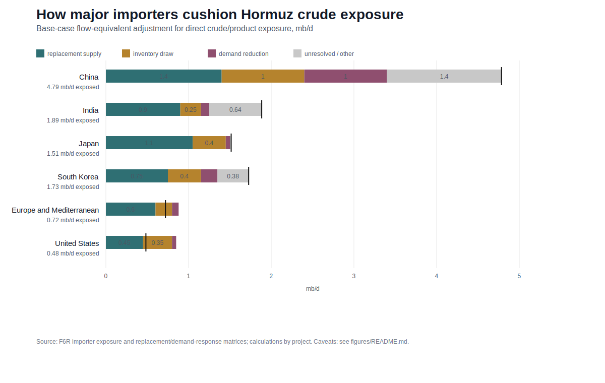

# Hormuz Importer Adjustment

Last updated: 2026-07-06.

## Bottom Line

The importer story is not "everyone replaces the same barrels." The most exposed countries use different adjustment mechanisms: Japan mostly bridges with alternate crude routes and reserves, India combines crude substitution with explicit gas/LPG rationing, China leans on opacity and system flexibility, and Europe is more exposed through global prices and LNG competition than through a large direct Hormuz crude flow.

For the blog post, the cleanest framing is:

- Asia is the physical center of exposure. EIA's 2024 route data put 84% of Hormuz crude/condensate and 83% of Hormuz LNG going to Asia.
- China is the largest crude exposure, but not the cleanest adjustment case. Public data show large exposure, lower refinery runs, import timing changes, and commercial/operational stock use; they do not show a clean government-SPR release.
- Japan is the best reserve-plus-substitution case. METI statements support named alternative routes, reserve releases, and 60%-70%+ alternative procurement against would-have-been Hormuz crude.
- India is the clearest rationing case. Official orders protect households/CNG first while cutting or managing gas, LPG, fertilizer, refinery, petrochemical, and commercial demand.
- Europe is a global-price and product-market case. Direct EU Hormuz crude exposure is moderate, but LNG competition, jet fuel/diesel, sour-crude refinery slates, freight, and insurance matter.

## Coolest Results

| Result | Why It Matters | Best Current Number | Confidence |
|---|---|---:|---|
| China is the biggest crude destination row. | It sets the upper bound for importer-side exposure, but public data do not decompose replacement barrels cleanly. | 4.785 mb/d 2024 Hormuz crude/condensate destination volume. | High for exposure; medium for adjustment split. |
| Japan has the cleanest public bridge. | Replacement routes and reserves are both visible in official statements. | Base adjustment: 1.05 mb/d replacement, 0.40 mb/d inventory draw, 0.05 mb/d demand reduction. | High. |
| India shows real rationing outside crude. | The most observable demand response is in gas/LPG, not crude oil. | Gas disruption denominator: 47.4 MMSCMD affected by force majeure; base demand destruction proxy: 20 MMSCMD. | Medium-high. |
| Korea is exposed but less observable. | Qatar LNG/condensate continuity matters, but public data are thin on actual replacement cargoes. | Base crude bridge: 0.75 mb/d replacement, 0.40 mb/d inventory draw, 0.20 mb/d demand reduction. | Medium-low. |
| Europe is not a simple physical-shortage story. | EU direct Hormuz shares are smaller than Asia's, but product and LNG prices still bite. | Base crude/product bridge row: 0.60 mb/d replacement and 0.20 mb/d inventory draw. | Medium. |
| The U.S. is a price-pass-through case. | Direct Gulf barrel exposure is small relative to global price exposure. | 0.484 mb/d direct crude/liquids exposure in the F6R chart data. | Medium-high. |

## Importer Exposure

The exposure matrix is source-backed but should not be read as customs truth. It uses public route/destination estimates, national statistics, and country-source notes where available.

| Importer / Region | Main Exposure | What We Can Say |
|---|---|---|
| China | Crude, LNG, petrochemical feedstocks, indirect fertilizer/chemical inputs. | CGEP summarizes 45%-50% of China's crude imports as Hormuz-transiting; public evidence supports lower runs and commercial stock use, not a proven large SPR release. |
| India | Crude, gas/LNG, LPG, fertilizers, petrochemical feedstocks. | Crude sourcing shifted toward non-Hormuz suppliers, while gas and LPG saw explicit priority allocation and demand management. |
| Japan | Crude, modest Qatar LNG exposure. | High crude dependence on the Middle East, but official statements identify alternative routes and reserve releases. LNG exposure is more price/market than near-term volume. |
| South Korea | Crude, Qatar LNG and condensate. | Public evidence supports supplier diplomacy and reserve capacity; replacement-volume and actual drawdown evidence remain weaker. |
| Europe / Mediterranean | Crude/products, Qatar LNG, jet/diesel, global price exposure. | EU-wide direct physical exposure is moderate, but Mediterranean refineries and product markets can be more exposed than the aggregate. |
| Southeast Asia | Crude, gas/LNG, LPG, petrochemicals, refined products. | IEA frames this as a broad regional vulnerability, but country-level public stock and replacement data are uneven. |

## Adjustment Buckets

The core output is `data/derived/hormuz_f6r_5_replacement_demand_response.csv`. The crude chart distills the most publishable mb/d rows into replacement supply, inventory draw, demand destruction, and residual or other exposure.

| Importer / Region | Exposure | Replacement Supply | Inventory Draw | Demand Destruction | Residual / Other | Confidence |
|---|---:|---:|---:|---:|---:|---|
| China | 4.785 mb/d | 1.400 | 1.000 | 1.000 | 1.385 | Medium |
| India | 1.885 mb/d | 0.900 | 0.250 | 0.100 | 0.635 | Medium-high |
| Japan | 1.515 mb/d | 1.050 | 0.400 | 0.050 | 0.015 | High |
| South Korea | 1.727 mb/d | 0.750 | 0.400 | 0.200 | 0.377 | Medium-low |
| Europe and Mediterranean | 0.721 mb/d | 0.600 | 0.200 | 0.080 | 0.000 | Medium |
| United States | 0.484 mb/d | 0.450 | 0.350 | 0.050 | 0.000 | Medium-high |

These numbers are scenario allocations, not observed vessel accounting. They should not be summed into a world total because some rows mix crude, products, and residual bridge assumptions.

## Country Reads

### China

China is the largest importer-side exposure and the most opaque adjustment case. Public evidence supports large pre-existing crude stocks, lower refinery runs, import timing changes, commercial/operational draws, product-export controls, and sanctioned/bonded/floating barrel complications.

Use China as a system-flexibility story. Avoid writing that China is "releasing a ton of SPR" unless a source identifies government-held SPR barrels and provides a balance-sheet bridge.

### India

India is the best demand-management case. Official releases say crude supply was diversified and non-Hormuz sourcing rose, while gas and LPG orders show the hierarchy of pain: households and CNG are protected first; industry, fertilizer, refineries, petrochemicals, restaurants, and commercial LPG users absorb cuts or allocation limits.

This is a useful blog contrast: crude substitution can look successful while gas/LPG scarcity still causes real rationing.

### Japan

Japan is the cleanest public adjustment case. METI named alternative crude routes and suppliers, started private and national reserve releases, and later canceled a third national release after alternative procurement improved.

This is the best example of reserves buying time rather than eliminating the shock.

### South Korea

Korea has high exposure, especially through Qatar LNG and condensate, but the public record is thinner. The visible response is supplier diplomacy and priority assurances from Qatar, plus known reserve rules and capacity. It is not yet a strong replacement-volume case.

### Europe

Europe is not the center of Hormuz crude flow, but it is exposed through Brent/products, jet fuel and diesel balances, sour-crude refinery constraints, LNG competition, and storage refill cost. Treat Mediterranean exposure as a candidate follow-up rather than a solved country-by-country table.

### Southeast Asia

Southeast Asia is structurally exposed, but the region should not be flattened into one importer. IEA highlights refining, petrochemicals, power generation, cooking fuels, naphtha, LPG, and subsidies/demand restraint. Public country-level stock and cargo data are still weaker than for Japan, India, or Europe.

## What We Know Versus What We Are Modeling

| Claim Type | Status |
|---|---|
| 2024 crude/LNG route destination shares | Strong for broad regions and top importers. |
| China crude exposure | Strong for scale; medium for exact source/origin behavior because relabeled and sanctioned barrels matter. |
| Japan crude adjustment | Strongest country case because official statements describe routes, reserve releases, and procurement percentages. |
| India gas/LPG demand response | Strong for policy direction and priority allocation; still modeled for flow-equivalent impacts. |
| Korea replacement volumes | Preliminary. Exposure is clear, but actual cargo replacement and demand curtailment are not public enough. |
| Europe physical exposure | Medium. EU aggregate is clearer than Mediterranean refinery-specific exposure. |
| LNG, fertilizer, sulfur, aluminium replacement | Real channels, but mixed units and weaker destination data mean they should stay outside the mb/d crude chart. |

## Blog Wording

Use:

- "The adjustment story differs by country: Japan substitutes and draws reserves; India rations gas and LPG; China uses opaque system flexibility."
- "These are scenario bridge estimates, not cargo-by-cargo accounting."
- "Direct U.S. physical exposure is small, but U.S. firms still face global oil, product, freight, and insurance price pass-through."
- "Europe's aggregate crude exposure is moderate, but LNG refill cost and product markets can still transmit the shock."

Avoid:

- "Asia replaced the lost supply" as a blanket statement.
- "China drew down its SPR" without distinguishing government SPR from commercial/operational stocks.
- Adding the crude chart rows as if they are a de-duplicated global total.
- Combining LNG, LPG, fertilizer, sulfur, aluminium, and crude into one volume chart.

## Files

- Epic: `issues/done/hormuz-f6r-rq3-map-destinations-and-importer-adjustment.md`
- Importer exposure matrix: `data/derived/hormuz_f6r_1_importer_exposure_matrix.csv`
- China adjustment matrix: `data/derived/hormuz_f6r_2_china_adjustment_matrix.csv`
- Europe/Mediterranean exposure matrix: `data/derived/hormuz_f6r_4_europe_exposure_matrix.csv`
- Replacement/demand-response matrix: `data/derived/hormuz_f6r_5_replacement_demand_response.csv`
- Crude importer adjustment figure: `figures/fig-f6r-crude-importer-adjustment.svg`
- Figure data: `figures/fig-f6r-crude-importer-adjustment-data.csv`
- Figure script: `scripts/build_f6r_destination_exposure_chart.py`

## Key Sources

- EIA, Strait of Hormuz oil chokepoint route data: https://www.eia.gov/todayinenergy/detail.php?id=65504
- EIA, Hormuz LNG route data: https://www.eia.gov/todayinenergy/detail.php?id=65584
- Columbia CGEP, China energy security and Hormuz exposure: https://www.energypolicy.columbia.edu/implications-of-the-conflict-in-the-middle-east-for-chinas-energy-security/
- JODI oil data: https://www.jodidata.org/
- China NBS energy production releases: https://www.stats.gov.cn/english/PressRelease/
- METI Japan press statements and reserve actions: https://www.meti.go.jp/english/speeches/press_conferences/2026/0303001.html and https://www.meti.go.jp/english/press/2026/0515_003.html
- Korea MOTIR Qatar LNG/condensate statement: https://english.motir.go.kr/eng/article/EATCLdfa319ada/2661/view
- India PIB energy-security statements: https://www.pib.gov.in/PressReleasePage.aspx?PRID=2238525&lang=1&reg=3 and https://www.pib.gov.in/PressReleasePage.aspx?PRID=2239021&lang=2&reg=3
- IEA Southeast Asia vulnerability note: https://www.iea.org/news/strait-of-hormuz-crisis-reinforces-need-for-southeast-asia-to-tackle-major-energy-vulnerabilities
- Eurostat / European Commission / ACER Europe energy and gas-market sources: https://ec.europa.eu/eurostat/ , https://energy.ec.europa.eu/ , https://www.acer.europa.eu/
