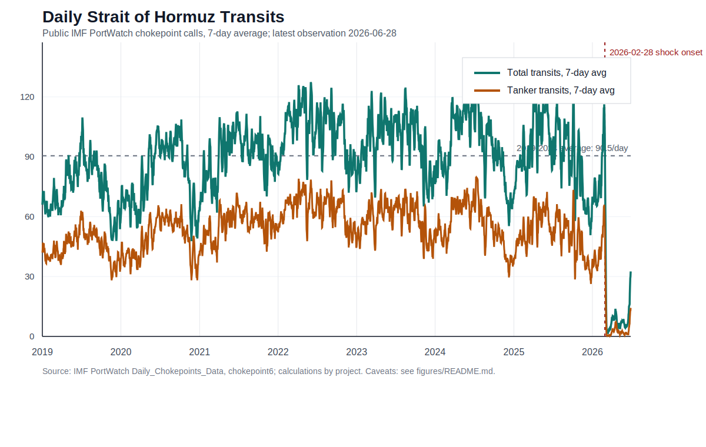

# Hormuz Ship Tracker

Last updated: 2026-07-06.

## Bottom Line

For the blog post, use the public IMF PortWatch series as the daily Strait of Hormuz ship tracker. It is reproducible, free, and covers 2019-01-01 through the latest public lag. The current local pull ends on 2026-06-28.

## What We Know

- PortWatch reports daily vessel calls through its Strait of Hormuz chokepoint boundary by broad class: total, tanker, container, dry bulk, general cargo, ro-ro, and cargo.
- The 2019-2024 baseline in our derived tracker averages 90.5 total transits/day and 54.8 tanker transits/day.
- The shock is clearly visible: PortWatch shows 152 total transits and 83 tanker transits on 2026-02-22, then 4 total transits and 0 tanker transits on 2026-03-07.
- The latest local observation, 2026-06-28, shows 27 total transits and 12 tanker transits, about 29.8% and 21.9% of the 2019-2024 baseline respectively.

## What We Do Not Know From Public Data

- Individual vessel identities.
- Direction of each transit.
- Exact gate-crossing tracks.
- AIS-dark or spoofed vessel movements.
- Actual cargo onboard each ship.

That means this tracker can support claims about broad traffic collapse and recovery, but not exact cargo loss, country-level exposure, or vessel-by-vessel behavior. Those require cargo-flow data or paid/raw AIS.

## Files

- Tracker data: `data/derived/hormuz_2y7_public_daily_tracker.csv`
- Chart: `figures/fig-2y7-public-hormuz-daily-transits.svg`
- Figure data: `figures/fig-2y7-public-hormuz-daily-transits.csv`
- Source pull: `data/external/portwatch/hormuz_daily_chokepoint.csv`
- Rebuild scripts: `scripts/fetch_portwatch_hormuz.py` and `scripts/build_public_hormuz_tracker.py`

## Blog Wording

Use: "IMF PortWatch daily chokepoint calls show..."

Avoid: "We tracked every ship..." or "these tankers carried X barrels..." The public tracker does not prove either.
