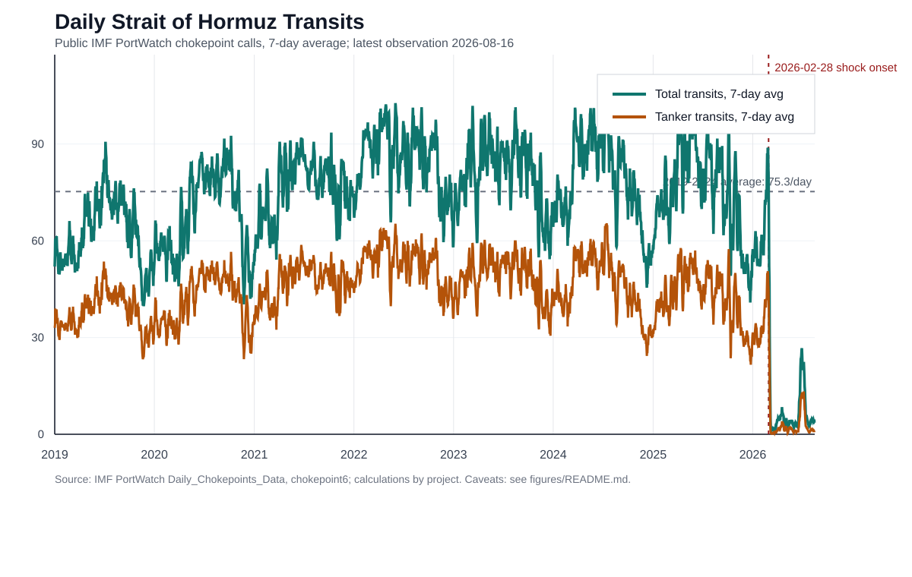

# Hormuz Ship Tracker

Last updated: 2026-08-18.

## Bottom Line

For the blog post, use the public IMF PortWatch series as the daily Strait of Hormuz ship
tracker. It is reproducible, free, and covers 2019-01-01 through the latest public lag. The
current pull ends on **2026-08-16**; the ArcGIS layer reports a last edit at
**2026-08-18 12:34:23.600 UTC**. The two-day tail lag is short, but recent observations remain
provisional because the public layer has no row-level final/revised flag.

## What We Know

- PortWatch reports daily vessel calls through its Strait of Hormuz chokepoint boundary by
  broad class: total, tanker, container, dry bulk, general cargo, ro-ro, and cargo.
- The latest source refresh revised almost the entire history, not just the tail: 2,721 of
  2,761 overlapping daily total observations and 2,669 tanker observations differ from the
  July-vintage local pull. The current 2019-2024 baseline is therefore **75.3 total** and
  **45.7 tanker calls/day**, down from the July-vintage 90.5 and 54.8. Comparisons across
  vintages should not be interpreted as new traffic.
- The revised June relaxation remains visible. From 2026-06-24 through 2026-07-07, traffic
  averaged **24.6 total** and **12.9 tanker calls/day** (32.6% and 28.3% of the revised
  baselines). The July-vintage estimates were 31.9 and 15.5 against the old baselines.
- The current low regime, 2026-07-08 through 2026-08-16, averages **4.125 total** and
  **1.425 tanker calls/day** (5.5% and 3.1% of baseline). For comparison, the July-vintage
  2026-07-08 through 2026-07-23 estimate was 10.625 and 3.5 (11.7% and 6.4% of the old
  baseline).
- August does not yet support a distinct regime: 2026-08-01 through 2026-08-16 averaged
  **3.812 total** and **1.250 tanker calls/day**, close to the revised 2026-07-08 through
  2026-07-31 averages of 4.333 and 1.542.
- The latest single day, 2026-08-16, records 1 total and 1 tanker call; its seven-day averages
  are 3.57 total and 1.14 tanker calls/day. Use the multi-day regime average for scenarios.

The draft's sustained-traffic claim survives, but should be precise: **even the June
recovery's seven-day average peaked at 26.7 total and 13.3 tanker calls/day—about 35% and
29% of the current prewar baselines—so traffic never came close to prewar levels in sustained
terms.** A single-day maximum is less strong evidence: after 2026-06-17, daily counts reached
44 total and 21 tanker calls (58% and 46% of baseline).

## July Nowcast Check

The former nowcast projected 85 total and 28 tanker calls for 2026-07-24 through 2026-07-31.
The refreshed PortWatch history records **29 total and 7 tanker calls** over those dates. The
nowcast therefore overestimated traffic by 56 total calls (65.9%) and 21 tanker calls (75.0%).
Those dates are now treated exclusively as observed history; no July nowcast rows remain in
the current scenario artifact.

## What We Do Not Know From Public Data

- Individual vessel identities or direction of travel.
- Exact gate-crossing tracks.
- AIS-dark or spoofed vessel movements.
- Actual cargo onboard each ship.

This tracker supports claims about broad traffic levels, not exact cargo loss, country-level
exposure, or vessel-by-vessel behavior. Those require cargo-flow data or paid/raw AIS.

## Provisional Scenario Baseline

Hold the revised 2026-07-08 through 2026-08-16 regime mean constant after the observed
cutoff: **4.125 total** and **1.425 tanker calls/day**. Approximate sampling intervals for
those means are 3.375-4.875 total and 1.075-1.775 tanker calls/day. These ranges capture
sampling variation only; they exclude future source revisions, AIS-dark traffic, direction,
vessel mix, and cargo uncertainty. The scenario CSV carries that rate only to future
September, December, and March horizons.

## Sources and Files

- Source: [IMF PortWatch Daily Chokepoints Data ArcGIS layer](https://services9.arcgis.com/weJ1QsnbMYJlCHdG/arcgis/rest/services/Daily_Chokepoints_Data/FeatureServer/0), filtered to `chokepoint6`.
- Tracker data: `data/derived/hormuz_2y7_public_daily_tracker.csv`
- Chart and figure data: `figures/fig-2y7-public-hormuz-daily-transits.svg` and `.csv`
- Source pull: `data/external/portwatch/hormuz_daily_chokepoint.csv`
- Scenario baseline: `data/derived/hormuz_m8q_2_current_traffic_scenario.csv`
- Interactive widget: `blogpost/hormuz-ship-tracker-widget.html`
- Rebuild scripts: `scripts/fetch_portwatch_hormuz.py`,
  `scripts/build_public_hormuz_tracker.py`, and
  `scripts/build_blogpost_ship_tracker_widget.py`

## Blog Wording

Use: "IMF PortWatch daily chokepoint calls show..."

Avoid: "We tracked every ship..." or "these tankers carried X barrels..." The public tracker
does not prove either.
