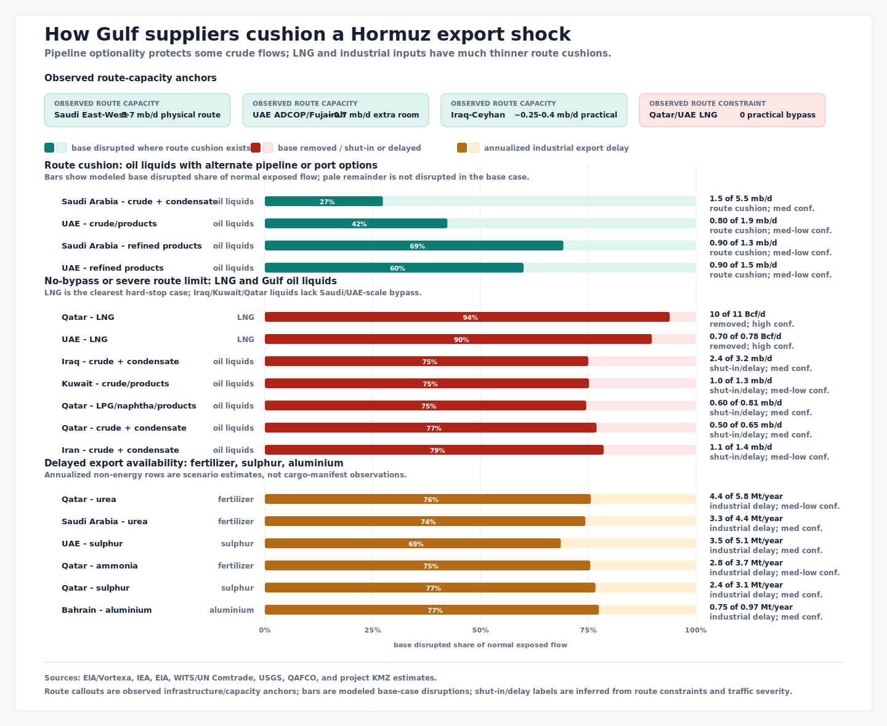

# Hormuz Supplier-Side Cushioning

Last updated: 2026-07-14.

## What the Figure Measures

The figure estimates how much of each supplier's normal **Hormuz-routed** oil or LNG exports could still reach the world market during a sustained effective closure. "Recoverable" means displaced flow that can use an operational route outside Hormuz. It does not include exports that already used that route before the shock, storage that merely postpones a shut-in, or risky passages through the Strait.

The denominators come directly from the two 2024 EIA/Vortexa baseline Sankeys. Oil pools crude/condensate and the Sankey's indicative refined-products/LPG allocation by origin. The oil rows sum to 20.26 mb/d. LNG uses the named Qatar and UAE origin rows; the Sankey's 0.37 Bcf/d residual "other origins" is omitted. All displayed values are rounded and carry a tilde.

## Estimates

| Supplier | Baseline math | Recoverable | Confidence | Basis |
|---|---:|---:|---|---|
| Saudi Arabia oil | 5.48 crude/condensate + 1.30 products/LPG = 6.78 mb/d | ~4.0 mb/d | Medium | Midpoint of the IEA's 3-5 mb/d estimate of early-2026 spare East-West Pipeline capacity. Aramco subsequently demonstrated 7.0 mb/d total pipeline throughput, but about 2 mb/d feeds west-coast refineries, leaving about 5 mb/d gross export capacity. The estimate counts only capacity available to absorb former Hormuz flow. |
| UAE oil | 1.89 + 1.50 = 3.39 mb/d | ~0.7 mb/d | Medium-high | IEA reports ADCOP/Fujairah capacity near 1.8 mb/d and about 1.1 mb/d normally using it, leaving up to 0.7 mb/d incremental room. |
| Iraq oil | 3.22 + 0.48 = 3.70 mb/d | ~0.3 mb/d | Medium | Approximately 0.25 mb/d through the northern Iraq-Turkiye route plus a small demonstrated products flow overland through Syria. Southern production around Basra is not connected to these routes. |
| Iran oil | 1.40 + 1.00 = 2.40 mb/d | ~0.05 mb/d | Low | Two reported Jask cargoes over roughly three months imply only about 0.04-0.05 mb/d. This uses demonstrated flow rather than the Goreh-Jask system's much higher nameplate rating. |
| Kuwait oil | 1.33 + 0.86 = 2.18 mb/d | ~0 mb/d | High | No operational non-Hormuz oil export route. Storage can delay, but not avoid, production and refinery cuts. |
| Qatar oil | 0.65 + 0.81 = 1.45 mb/d | ~0 mb/d | High | No operational non-Hormuz route for crude, condensate, LPG, or refined products. |
| Other oil | 0.35 mb/d | ~0 mb/d | Low | This is an unresolved residual in the EIA/Vortexa origin data. No separately evidenced operational bypass is assigned. |
| Qatar LNG | 9.28 Bcf/d | ~0 Bcf/d | High | Ras Laffan has no route to the global LNG market that avoids Hormuz. |
| UAE LNG | 0.70 Bcf/d | ~0 Bcf/d | High | Das Island has no route to the global LNG market that avoids Hormuz. |

The oil baseline is high confidence for crude/condensate and lower for the country split of products/LPG. EIA/Vortexa publishes the route-wide products total but not a country-origin split, so the Sankey allocates that total using country export proxies and a Kuwait residual. Pooling avoids implying more product detail than the source supports, but it also means the Saudi/UAE recovery numerators are mostly crude capacity inside broader oil denominators. The 0.3 mb/d Saudi NGL pipeline is not added because the [IEA reports it is fully utilized](https://www.iea.org/about/oil-security-and-emergency-response/strait-of-hormuz).

## Storage, Delay and Production

Oil in accessible onshore tanks, floating storage, or overseas terminals can usually be sold later. This makes a short interruption partly a timing shock. It does not sustain normal daily exports: when usable tanks fill, upstream production must be shut in and export-oriented refineries must cut runs as product tanks fill. The [IEA estimated at least 8 mb/d of crude and another 2 mb/d of condensates/NGLs were curtailed](https://www.iea.org/reports/oil-market-report-march-2026) during the acute closure.

Saudi Arabia used domestic and international storage but does not publish a current, auditable physical total. The UAE's Mandous complex near Fujairah holds 42 million barrels and can release oil already positioned outside Hormuz; it cannot move new displaced production faster than the connected pipeline. Iraq's last public southern-storage figure was about 10 million barrels, roughly three days of its 2024 Hormuz crude baseline. [Qatar's condensate system was designed for about eight days at 0.5 mb/d](https://www.qatarenergylng.qa/Portals/0/DNNGalleryPro/uploads/2024/3/19/ThePioneer-September-October08.pdf). Kuwait reports large tank counts, and Iran reports inventories, but neither measure reveals empty working space. Reported production and refinery cuts are stronger evidence of the practical limit than nominal tank totals.

Where a closure ends before storage fills, much of the stored oil can be exported later. Where production is shut in, the oil generally remains in the reservoir and can be produced in a later period, but the missed daily supply is not instantly recovered. Export backlogs also compete with resumed production for terminal and tanker capacity. The [IEA's July accounting](https://www.iea.org/reports/oil-market-report-july-2026) shows this distinction: June Gulf exports rose faster than production partly because producers drew down stocks accumulated during the closure.

LNG is less forgiving. Liquefaction plants and LNG tanks are designed for continuous loading, not months of inventory accumulation. Once limited tank space is full, liquefaction and feedgas intake must fall; gas may be diverted to domestic use, reinjected where technically possible, or left unproduced. Only LNG already stored can be exported later.

[QatarEnergy LNG identifies 12 common Ras Laffan tanks](https://www.qatarenergylng.qa/english/Media/News/Article/ArticleID/232/QATARGAS%20LOADS%205000TH%20LNG%20CARGO%20FROM%20COMMON%20LNG%20STORAGE%20AND%20LOADING%20ASSET%20IN%20RAS%20LAFFAN) totaling 1.46 million cubic metres. At the EIA's approximate 600:1 gas-to-liquid volume ratio, that is a gross ceiling of about 31 Bcf, or 3.3 days of the figure's 9.3 Bcf/d Qatar baseline. Actual incremental space is smaller because tanks retain operating inventory and heel. No defensible public Das Island tank total was found, but ADNOC reported managing deferred cargoes as tank space tightened. Consistent with these short buffers, [IEA reports Qatar/UAE loadings fell by 35 bcm year on year from March through June](https://www.iea.org/reports/gas-market-report-q3-2026/executive-summary). The figure therefore assigns no sustained LNG recovery credit.

The realized 2026 Qatar loss is worse than the route-only bar: [Qatar's energy minister said](https://qna.org.qa/en/news/news-details?date=19%2F03%2F2026&id=minister-of-state-for-energy-affairs-iranian-attacks-disrupted-17-percent-of-gas-export-capacity) two of 14 liquefaction trains were damaged, removing an estimated 12.8 mtpa, or 17%, for three to five years. This does not change the structural bypass estimate, but it means reopening Hormuz cannot immediately restore the full prewar baseline.

## Routes Under Development

| Supplier | Project | Status and timing | Effect on the figure |
|---|---|---|---|
| UAE oil | New West-East crude pipeline to Fujairah | Under construction; the [Abu Dhabi Media Office](https://www.mediaoffice.abudhabi/en/crown-prince-news/khaled-bin-mohamed-bin-zayed-chairs-meeting-of-executive-committee-of-adnoc-board-of-directors-may-2026/) says it is due in 2027 and will double Fujairah export capacity. | Not included because it is not operational. It would materially increase future recoverability. |
| Iraq oil | Basra-Haditha pipeline | Construction began in 2026; reported design capacity is about 2.5 mb/d. It is intended to connect southern production to western/northern outlets, but a complete export chain and firm in-service date remain uncertain. | Not included. This is the most important potential change for Iraq, but pipe capacity at Haditha is not itself access to an operating seaport. |
| Iraq oil | Syria land route | A small products route is operating; crude trucking toward Baniyas was being developed at roughly 50 kb/d. A restored large pipeline remains prospective. | Only demonstrated current flow is included in the ~0.3 mb/d estimate. |
| Kuwait oil | Links through Saudi Arabia or the UAE | KPC has publicly discussed options, but no final route, investment decision, capacity, or completion date is public. | Not included; active study is not usable capacity. |
| Saudi Arabia oil | Possible East-West expansion | A further expansion of up to 2 mb/d has been reported as preliminary discussion, without a final investment decision or timeline. | Not included. |
| Iran oil | Goreh-Jask/Jask terminal | Existing infrastructure, not a new project. EIA estimates about 0.3 mb/d effective capacity, but actual loadings remain sparse and the IEA previously judged it non-viable. | Figure uses observed cargoes, not the capacity rating. |
| Qatar and UAE LNG | North Field expansion and Ruwais LNG | These add liquefaction capacity, not a bypass. Qatar's schedule has been delayed by conflict damage; [Ruwais LNG is scheduled for 2028](https://www.adnoc.ae/en/our-projects/ruwais-lng) but remains inside the Gulf. | Neither improves closure recoverability. No LNG bypass project with a credible operating timeline was identified. |
| Qatar pipeline gas | Dolphin pipeline | [Existing 2.0 Bcf/d pipeline-gas supply](https://www.dolphinenergy.com/en-US/Operations/) to the UAE and Oman; it is not an LNG route. Higher design capacity lacks the additional Qatar supply agreement needed to operate. | Not included. It serves regional pipeline-gas buyers and cannot deliver the figure's LNG to the world market. |
| Qatar corporate portfolio | Golden Pass LNG, United States | QatarEnergy owns 70%; [the first U.S.-gas train shipped in April 2026](https://www.eia.gov/todayinenergy/detail.php?id=67564) and the three-train project is designed for about 2.0 Bcf/d. | A real portfolio hedge, but not recovery of Qatari production or the 9.3 Bcf/d Hormuz baseline. |

## Main Caveats

- This is structural closure accounting, not a forecast of actual daily exports. Limited, insured, covert, or ceasefire-enabled Hormuz passages can make realized exports higher.
- Pipeline nameplate, demonstrated throughput, export-terminal capacity, and incremental spare capacity are different. The figure uses the last of these where possible.
- A barrel released from storage is delivered supply, but not sustained production capacity. Counting both it and the later refill would double count the same route flexibility.
- Military damage, power loss, sanctions, feedstock quality, terminal congestion, and contractual constraints can reduce technically recoverable volumes.
- The Saudi 3-5 mb/d range dominates the total uncertainty. The figure uses 4.0 mb/d as a midpoint, not a point forecast.

## Source Trail

- [EIA/Vortexa 2024 oil baseline and route data](https://www.eia.gov/todayinenergy/detail.php?id=65504)
- [EIA/Vortexa 2024 LNG baseline and route data](https://www.eia.gov/todayinenergy/detail.php?id=65584)
- [IEA Strait of Hormuz factsheet](https://www.iea.org/about/oil-security-and-emergency-response/strait-of-hormuz)
- [Aramco Q1 2026 results](https://www.aramco.com/en/news-media/news/2026/aramco-announces-first-quarter-2026-results)
- [EIA world oil transit chokepoints](https://www.eia.gov/international/content/analysis/special_topics/World_Oil_Transit_Chokepoints/)
- [IEA Gulf supplier adjustment commentary](https://www.iea.org/commentaries/how-global-oil-supplies-have-readjusted-to-help-fill-the-huge-gap-left-by-the-strait-of-hormuz-shock)
- [ADNOC Gas LNG operations](https://adnocgas.ae/en/Our-Operations/LNG)
