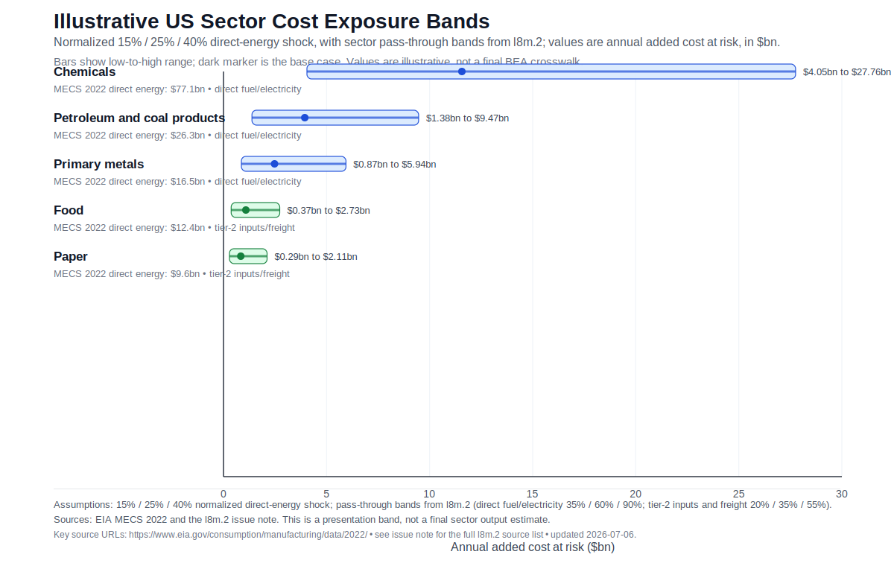
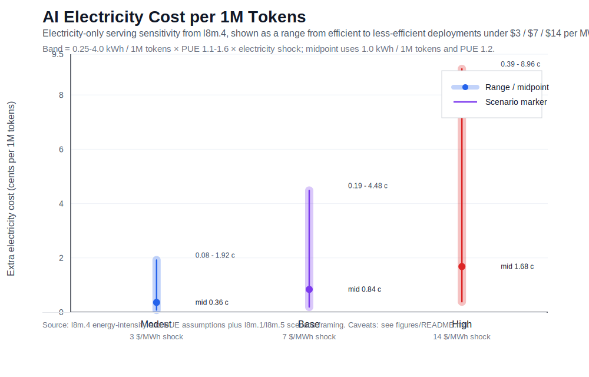

# Hormuz U.S. Business And AI Cost Impacts

Last updated: 2026-07-06.

## Bottom Line

The most interesting result is not that AI becomes dramatically more expensive. It is the opposite: the direct electricity cost per token barely moves in most plausible U.S. power-price scenarios, while the visible business pain concentrates in older, fuel- and materials-heavy sectors.

For the blog post, the cleanest framing is:

- U.S. business exposure is sectoral, not uniform. Transport, refining, chemicals, fertilizer-linked food chains, primary metals, and freight-sensitive goods move first.
- The direct AI token-cost channel is small. In the base power-price sensitivity, the added electricity cost is about `$0.0019-$0.0448` per `1M` tokens, or less than five cents per million tokens.
- Data centers still matter, but mostly through regional power markets, site contracts, and grid congestion. A Texas or PJM site exposed to spot wholesale power is a different case from a hedged or regulated-utility customer.
- Macro inflation evidence should cap the story. Bottom-up energy math can look dramatic, but U.S. oil-price pass-through estimates are usually measured in tenths of a percentage point for a 10% oil shock, not several points of headline inflation.

## Scenario Anchor

Use the `hormuz-l8m` package as a scenario-sensitivity estimate, not as a realized final bill.

The central scenario is tied to EIA's June 2026 STEO. In that case, Brent is elevated near term and then eases: EIA reports Brent averaged `$117/b` in April 2026 and `$107/b` in May, then forecasts about `$105/b` in June and July and `$89/b` by 4Q26. U.S. product prices move more directly into business costs: EIA's June path has wholesale gasoline about `+$1.00/gal`, diesel `+$1.34/gal`, and jet fuel `+$1.42/gal` above the February STEO counterfactual.

The important AI caveat is natural gas. EIA's central U.S. gas path is not a huge domestic shock: Henry Hub averaged `$2.94/MMBtu` in May 2026 and EIA expected about `$3.34/MMBtu` in 2H26 and `$3.60/MMBtu` for 2026. That means the U.S. electricity channel is mostly a regional and high-scenario question, not an automatic national spike.

## Business Cost Results

The current sector table is anchored in EIA MECS 2022 manufacturing energy expenditures and `l8m.2` pass-through bands. It is good enough for ranking and a first blog figure. It is not yet a full BEA input-output estimate for every U.S. sector.

| Sector | Direct energy anchor | Base added-cost band result | Why it matters |
|---|---:|---:|---|
| Chemicals | `$77.1bn` purchased energy spend | `$11.6bn` | Biggest direct anchor; also exposed to gas, HGL/LPG, fertilizer, sulfur, plastics, and freight. |
| Petroleum and coal products | `$26.3bn` | `$3.9bn` | Refining and product cracks transmit crude, diesel, jet, and freight shocks. |
| Primary metals | `$16.5bn` | `$2.5bn` | Electricity-intensive and exposed to aluminium, coke, ore, and construction chains. |
| Food | `$12.4bn` | `$1.1bn` | Direct energy is moderate, but fertilizer, diesel, cold chain, and packaging can dominate. |
| Paper | `$9.6bn` | `$0.8bn` | Meaningful process-energy exposure, though byproduct fuels can soften cash-cost impact. |

The ranking is more robust than the exact dollar totals. A full publication estimate should add the BEA gross-output and input-output crosswalk before claiming economy-wide costs.

## Data Centers And Power

The power-market rule of thumb is:

`+$1/MMBtu gas -> about +$7/MWh wholesale power`

That uses a roughly `7 MMBtu/MWh` marginal gas heat rate. Stress periods can be higher, especially when peakers or congestion set the price.

| Region / market | Indicative power-cost change for `+$1/MMBtu` gas | Read |
|---|---:|---|
| ERCOT | `+$7 to +$10/MWh` | Highest short-run sensitivity for Texas data-center loads. |
| PJM / NYISO / ISO-NE | `+$6 to +$9/MWh` | Strong gas linkage, but congestion and retail lag matter. |
| MISO / SPP | `+$5 to +$8/MWh` | Meaningful but node-specific. |
| CAISO | `+$4 to +$8/MWh` | Gas matters in evenings and winter; solar/hydro mute daytime effects. |
| Northwest / Mid-Columbia | `+$2 to +$5/MWh` | Hydrology and transmission can matter more than gas. |
| Southeast regulated utilities | `+$2 to +$6/MWh` retail, with lag | Fuel recovery is slower and contract-specific. |

For AI, the electricity-only result is small:

| Power-price shock | Added electricity cost per `1M` tokens | Total serving-cost implication if electricity is 5%-15% of fully loaded cost |
|---|---:|---:|
| `+$3/MWh` | `$0.0008-$0.0192` | `+0.3%-0.9%` |
| `+$7/MWh` | `$0.0019-$0.0448` | `+0.7%-2.1%` |
| `+$14/MWh` | `$0.0038-$0.0896` | `+1.4%-4.2%` |

This is the marginal electricity component only. It holds GPU capex, networking, storage, software, labor, utilization, and margin fixed. It should not be compared directly to public API list prices as if list price were serving cost.

## Macro Sanity Check

Use macro evidence to prevent overclaiming.

- BLS December 2025 CPI relative-importance weights imply motor fuel plus household energy were about `7.53%` of CPI. A mechanical `10%` retail-energy shock is therefore about `0.75 pp` before substitution, hedging, lags, and spillovers.
- BLS PPI final-demand energy appears near `5.0%-5.2%` in the December 2025 relative-importance table, but the exact column should be rechecked before a final public citation.
- A Federal Reserve FEDS model note estimates a `10%` oil-price increase raises U.S. headline inflation by about `0.15 pp` over the first four quarters, fading after that.
- IMF cross-country work finds larger average pass-through in broader samples, but still supports the same rule: energy shocks matter, yet the realized macro effect depends heavily on market structure, policy, currency, and expectations.

The blog implication: the best claim is not "Hormuz makes everything expensive." It is "Hormuz creates sharp input-cost shocks in specific sectors, while the AI token-cost channel is surprisingly small unless local power markets spike."

## What We Know Versus What We Are Modeling

| Claim Type | Status |
|---|---|
| EIA central oil, product, and gas price scenario | Strong public forecast anchor. |
| Sector ranking for direct U.S. business energy exposure | Medium-high for manufacturing anchors; still provisional for full all-sector totals. |
| Regional power-price sensitivity | Medium. Strong formula, but local basis, congestion, tariff, and hedge details determine actual data-center bills. |
| AI electricity-only cost per token | Medium. Formula is transparent, but model-specific throughput, batching, utilization, and hardware mix are not public. |
| Fully loaded AI provider cost or margin impact | Not knowable from public data. Do not claim it. |
| Economy-wide inflation effect | Use macro literature as a bounded cross-check, not a direct bottom-up sum. |

## Blog Wording

Use:

- "The AI result is counterintuitive: the direct electricity cost per token is tiny in cents-per-million-token terms."
- "The business cost shock is concentrated in transport, chemicals, refining, metals, and fertilizer-linked food chains."
- "Regional power exposure matters more than the national oil headline for data centers."
- "These are scenario sensitivities, not observed company-level bills."

Avoid:

- "AI costs explode because of Hormuz."
- "Cost per token rises by X%" without saying whether X is electricity-only or fully loaded serving cost.
- "U.S. businesses pay Y billion more" as an economy-wide total before the BEA input-output crosswalk is finished.
- Comparing public API list prices directly to electricity-only serving costs.

## Files

- Epic: `issues/done/hormuz-l8m-rq5-estimate-us-business-and-ai-cost-impacts.md`
- Price scenarios: `issues/done/hormuz-l8m.1-define-commodity-price-shock-scenarios.md`
- Sector costs: `issues/done/hormuz-l8m.2-estimate-added-cost-to-us-businesses-by-sector.md`
- Data-center power sensitivity: `issues/done/hormuz-l8m.3-estimate-us-power-price-implications-for-data-centers.md`
- AI token-cost sensitivity: `issues/done/hormuz-l8m.4-estimate-ai-cost-per-token-sensitivity.md`
- Macro cross-checks: `issues/done/hormuz-l8m.5-cross-check-against-macro-inflation-and-energy-models.md`
- Visuals: `issues/done/hormuz-l8m.6-produce-us-business-and-ai-cost-visuals.md`
- Sector figure data: `data/derived/hormuz_l8m_6_sector_exposure_bands.csv`
- AI figure data: `data/derived/hormuz_l8m_6_ai_electricity_cost_sensitivity.csv`

## Key Sources

- EIA STEO global oil markets: https://www.eia.gov/outlooks/steo/report/global_oil.php
- EIA STEO petroleum products: https://www.eia.gov/outlooks/steo/report/petro_prod.php
- EIA STEO natural gas: https://www.eia.gov/outlooks/steo/report/natgas.php
- EIA MECS 2022 manufacturing data: https://www.eia.gov/consumption/manufacturing/data/2022/
- EIA wholesale electricity markets: https://www.eia.gov/electricity/wholesale/
- EIA Electricity Monthly Update: https://www.eia.gov/electricity/monthly/update/wholesale-markets.php
- BLS CPI relative importance: https://www.bls.gov/cpi/tables/relative-importance/
- BLS PPI tables: https://www.bls.gov/ppi/tables/
- Federal Reserve FEDS note on oil-price shocks and inflation: https://www.federalreserve.gov/econres/notes/feds-notes/oil-price-shocks-and-inflation-in-a-dsge-model-of-the-global-economy-20240802.html
- IMF oil-price pass-through working paper: https://www.imf.org/en/publications/wp/issues/2017/09/05/oil-prices-and-inflation-dynamics-evidence-from-advanced-and-developing-economies-45180
- Google data center efficiency/PUE context: https://datacenters.google/operating-sustainably
- NVIDIA H100 product context: https://www.nvidia.com/en-us/data-center/h100/
- LLM inference energy literature examples: https://arxiv.org/html/2505.09598v1 and https://arxiv.org/html/2407.16893v2
